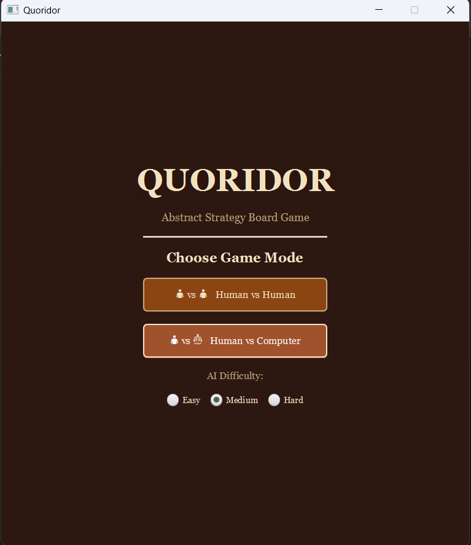
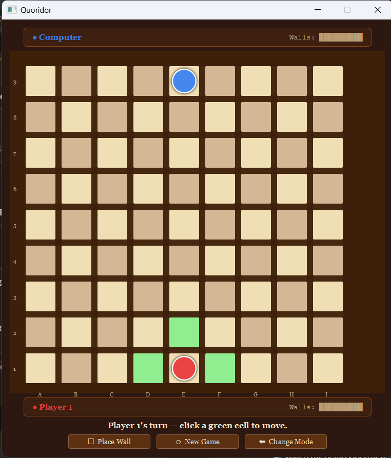
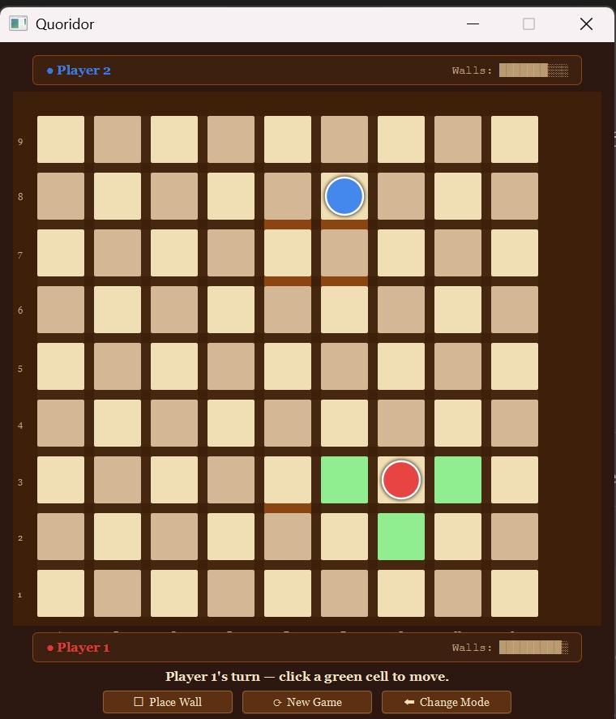
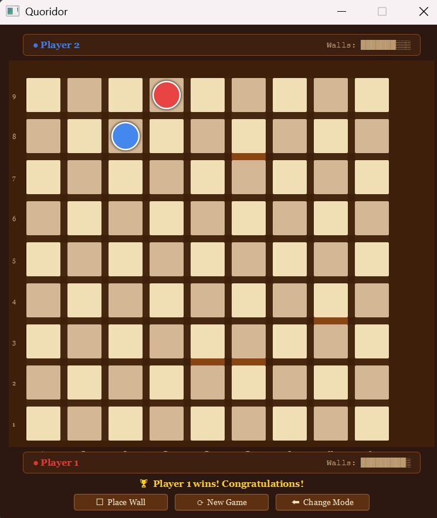

# Quoridor — Java & JavaFX Implementation

> A complete two-player implementation of the abstract strategy board game **Quoridor**, built with Java 17 and JavaFX 17.  
> Features a full graphical interface, enforced game rules, three AI difficulty levels, and undo/redo support.

---

## Table of Contents

- [Game Description](#game-description)
- [Screenshots](#screenshots)
- [Features](#features)
- [Project Structure](#project-structure)
- [Requirements](#requirements)
- [Installation & Running](#installation--running)
- [Controls](#controls)
- [Game Rules](#game-rules)
- [AI Opponent](#ai-opponent)
- [Bonus Feature — Undo / Redo](#bonus-feature--undo--redo)
- [Demo Video](#demo-video)
- [Team](#team)

---

## Game Description

Quoridor is an abstract strategy board game invented by Mirko Marchesi (1997) and winner of the Mensa Mind Game award. Two players race their pawns across a 9×9 board to the opposite side while placing walls to block each other's path. Walls cannot completely cut off a player's route — there must always be at least one valid path to the goal.

---

## Screenshots

### 1. Main Menu & Difficulty Selection
<p align="center">
  
</p>

### 2. Game Board at Start
<p align="center">
  
</p>

### 3. Mid-Game with Walls Placed
<p align="center">
  
</p>

### 4. Win Screen
<p align="center">
  
</p>
---

## Features

### Core
- Complete Quoridor ruleset for 2 players
- Normal pawn movement (orthogonal)
- Jump over opponent's pawn (straight and diagonal)
- Wall placement with overlap, crossing, and path-blocking validation
- BFS pathfinding to enforce the "must always have a path" rule
- Human vs Human mode
- Human vs Computer mode
- Valid move highlighting (green cells)
- Wall slot hover preview
- Wall count display for each player
- Turn indicator and status messages
- Win detection with congratulations message
- New Game and Change Mode buttons

### Bonus
- **Undo / Redo** — revert and reapply moves at any time during the game

---

## Project Structure

```
quoridor/
├── pom.xml
└── src/
    └── main/
        └── java/
            └── com/
                └── quoridor/
                    ├── Main.java
                    ├── controller/
                    │   └── GameController.java
                    ├── model/
                    │   ├── Board.java
                    │   ├── Direction.java
                    │   ├── GameState.java
                    │   ├── MoveValidator.java
                    │   ├── Player.java
                    │   ├── Position.java
                    │   └── Wall.java
                    ├── view/
                    │   ├── BoardRenderer.java
                    │   └── GameView.java
                    └── ai/
                        └── AIPlayer.java
```

### Architecture — MVC Pattern

| Layer | Classes | Responsibility |
|---|---|---|
| **Model** | `GameState`, `Board`, `Player`, `Wall`, `Position`, `MoveValidator` | All game rules and state — zero JavaFX |
| **View** | `GameView`, `BoardRenderer` | Everything the user sees — zero game logic |
| **Controller** | `GameController` | Bridges model and view — handles input, validates and applies moves |
| **AI** | `AIPlayer` | Computer opponent — reads model, produces moves |

---

## Requirements

- **Java 17** (JDK 17 or higher)
- **Maven 3.8+**
- Internet connection on first run (Maven downloads JavaFX 17.0.6 automatically)

To check your versions:
```bash
java -version
mvn -version
```

---

## Installation & Running

### 1. Clone the repository
```bash
git clone https://github.com/marwamohamed-source/quoridor-boardgame.git
cd quoridor
```

### 2. Build and run
```bash
mvn clean javafx:run
```

Maven will automatically download all dependencies (JavaFX 17.0.6) on the first run. No manual setup required.

### 3. Windows-specific note
If the window title bar does not appear, the `pom.xml` already includes the required JVM flags (`-Dprism.order=sw`, `-Dglass.win.uiScale=1.0`) to fix this on Windows 11.

---

## Controls

### Mode Selection Screen
| Action | How |
|---|---|
| Play Human vs Human | Click **👤 vs 👤 Human vs Human** |
| Play vs Computer | Click **👤 vs 🤖 Human vs Computer** |
| Set AI difficulty | Select **Easy**, **Medium**, or **Hard** before starting |

### In Game
| Action | How |
|---|---|
| **Move pawn** | Click any green-highlighted cell |
| **Switch to wall placement mode** | Click the **🧱 Place Wall** button, or click directly on a wall slot |
| **Place a wall** | Hover over a gap between cells to preview, then click to place |
| **Switch back to pawn mode** | Click the **♟ Move Pawn** button |
| **Undo last move** | Click **↩ Undo** |
| **Redo undone move** | Click **↪ Redo** |
| **New Game** | Click **⟳ New Game** (same mode) |
| **Change Mode** | Click **⬅ Change Mode** (returns to mode selection) |
| **Exit** | Click **✕ Exit** or the window's close button |

### Board Layout
- **Player 1** (Red) starts at the bottom centre — moves toward row 9 (top)
- **Player 2 / Computer** (Blue) starts at the top centre — moves toward row 1 (bottom)
- Columns are labelled **A–I** (left to right)
- Rows are labelled **1–9** (bottom to top)

---

## Game Rules

1. The board is **9×9 squares**.
2. Each player starts at the centre of their baseline with **10 walls**.
3. On each turn a player must either **move their pawn** OR **place a wall** — not both.
4. Pawns move **one square orthogonally** (up, down, left, right).
5. Pawns **cannot move through walls**.
6. If the opponent's pawn is directly adjacent, you may **jump straight over** them (if no wall blocks the landing cell).
7. If the straight jump is blocked by a wall or the board edge, you may instead move **diagonally** to either side of the opponent.
8. Walls are **two cells long** and placed in the gaps between cells.
9. Walls **cannot overlap or cross** existing walls.
10. A wall placement is **illegal if it completely blocks any player's path** to their goal row — BFS validation enforces this.
11. The first player to reach **any cell on the opposite baseline** wins.

---

## AI Opponent

The computer opponent has three difficulty levels selectable before the game starts.

| Difficulty | Algorithm | Search Depth | Wall Strategy |
|---|---|---|---|
| **Easy** | Greedy | Depth 1 | Never places walls — always advances toward goal |
| **Medium** | Minimax | Depth 2 | Places up to 6 strategically chosen walls |
| **Hard** | Minimax + Alpha-Beta Pruning | Depth 3 | Places up to 10 strategically chosen walls |

### Evaluation Function
The AI scores each position using three components:
- **Path difference** × 10 — opponent's BFS distance to goal minus AI's BFS distance (most important)
- **Wall advantage** × 2 — AI walls remaining minus opponent's walls remaining
- **Progress bonus** — how many rows the AI has advanced toward its goal

### Wall Selection
Rather than evaluating all 128 possible wall placements at each node, the AI pre-scores walls by how much they lengthen the opponent's shortest path relative to the AI's own path, and only passes the top N candidates to the search tree. This makes Hard difficulty responsive without freezing the UI.

The AI runs on a **background thread** — the UI remains interactive while it thinks.

---

## Bonus Feature — Undo / Redo

The project implements **Undo / Redo** as the bonus feature (+10%).

- **Undo** restores the game to the state before the last human move. The ↩ Undo button is greyed out when there is nothing to undo.
- **Redo** re-applies the last undone move. The ↪ Redo button is greyed out when there is nothing to redo.
- Making a new move after undoing clears the redo history.
- History is capped at **50 moves** to keep memory usage bounded.
- Each history entry is a **full deep copy** of the `GameState`, implemented via `GameState.copy()`.

---

## Demo Video

> 📹 [Link to demo video](https://drive.google.com/drive/folders/1vs-QG1bKIiw9qfAKconNdjiujcUJ_zem?usp=drive_link)  


The video covers:
- UI overview and mode selection
- Human vs Human gameplay including wall placement and jump moves
- Human vs Computer gameplay on Hard difficulty
- Undo / Redo demonstration

---

## Team

| Name | ID |
|---|---|
| Marwa Mohamed  | 2301138|
| Menna Tallah Abdelrahman| 2300924 |
| Jana Sameh |2301019 |
| Malak Hamdi | 2300449|
| Malak Mostafa  |2300713|

---

## References

- [Official Quoridor Rules](https://en.gigamic.com/files/media/fiche_pedagogique/educative-sheet_quoridor_english.pdf)
- [Quoridor on BoardGameGeek](https://boardgamegeek.com/boardgame/624/quoridor)
- [Minimax Algorithm with Alpha-Beta Pruning](https://en.wikipedia.org/wiki/Alpha%E2%80%93beta_pruning)
- [BFS Pathfinding](https://en.wikipedia.org/wiki/Breadth-first_search)
- [JavaFX 17 Documentation](https://openjfx.io/javadoc/17/)
- [Maven JavaFX Plugin](https://github.com/openjfx/javafx-maven-plugin)
